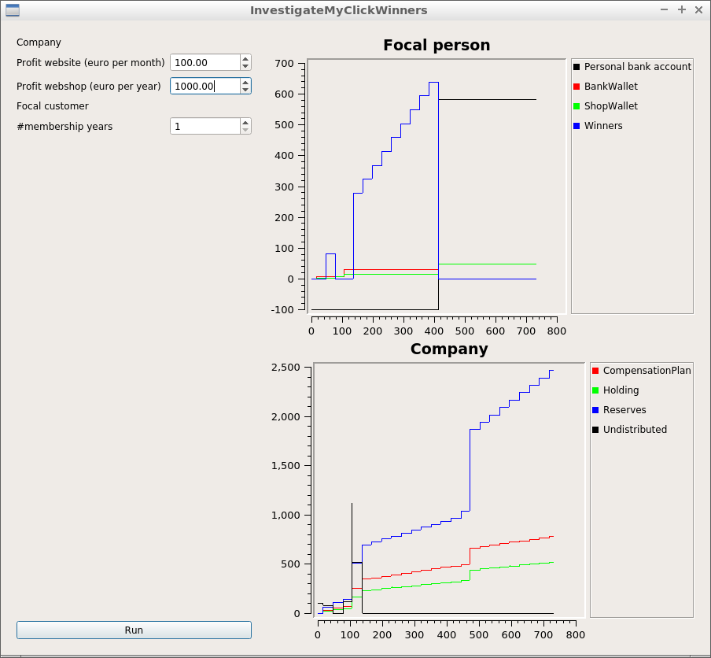

# InvestigateMyClickWinners

Tool to investigate the flow of money of MyClickWinners.

 * [Download the Windows executable](http://richelbilderbeek.nl/InvestigateMyClickWinners.zip)

## Example

This is a premature example! See 'Issues' to see what is not implemented yet.

The parameters of this simulation are:

 * There is one customer
 * The focal customer has bought a Starter WinnerPackage (a ClickCard that is valid for a year and one Winner)
 * The focal customer is member for a year
 * The focal customer keeps clicking until all his/her Winners are full. Then the ShopWallet is transferred to the personal balance
 * The MyClickWinners webshop makes 1000 euro profit per year
 * The MyClickWinners website makes 100 euro profit per month

It can be observed that under these parameters the focal person will acquire money:

